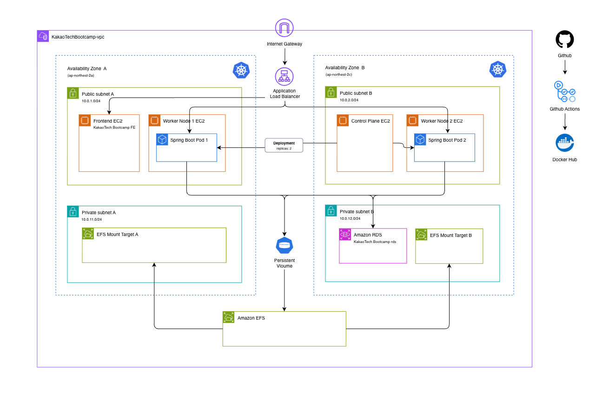

# KakaoTech Bootcamp Hub

[](https://github.com/user-attachments/assets/6a66ad63-29ab-42e5-a399-8a6f12b092f1)

> 카카오테크 부트캠프의 소식과 학생들의 이야기가 모이는 커뮤니티 백엔드입니다 <br>
> 학생들은 게시글을 작성하고 댓글과 좋아요로 소통하며 프로필과 계정을 관리할 수 있습니다
<br>

## 주요기능

<table>
  <tr>
    <th width="500px" align="center">계정관리</th>
    <th width="500px" align="center">커뮤니티</th>
  </tr>
  <tr>
    <td width="500px" valign="top">
      • 중복확인을 포함한 회원가입<br>
      • 이메일과 비밀번호를 통한 로그인<br>
      • 토큰기반 인증과 만료처리<br>
      • 프로필이미지와 닉네임 수정<br>
      • 새로운 비밀번호로 변경<br>
      • 로그아웃과 회원탈퇴
    </td>
    <td width="500px" valign="top">
      • 커서기반 페이지네이션<br>
      • 키워드로 게시글 검색<br>
      • 게시글 작성·조회·수정·삭제<br>
      • 게시글이미지 업로드<br>
      • 좋아요 등록과 취소<br>
      • 댓글 작성·수정·삭제
    </td>
  </tr>
</table>
<br>


## 기술스택
- Language | Java 17
- Framework | Spring Boot 4.0.6 
- Security | Spring Security & JWT
- ORM | Spring Data JPA & QueryDSL
- Database | MySQL
- Container | Docker
- Orchestration | Kubernetes & Helm
- CI/CD | GitHub Actions
- Container Registry | Docker Hub
- Infrastructure | AWS EC2 & AWS SSM

<br>

## 폴더구조
```text
src/main/java/com/daniel/community
├── Application.java
├── auth
│   ├── controller
│   ├── dto
│   └── service
├── user
│   ├── controller
│   ├── dto
│   ├── entity
│   ├── repository
│   └── service
├── post
│   ├── controller
│   ├── dto
│   ├── entity
│   ├── repository
│   └── service
├── comment
│   ├── controller
│   ├── dto
│   ├── entity
│   ├── repository
│   └── service
└── global
    ├── config
    ├── exception
    ├── response
    └── security
```
<br>

## 아키텍처

<br>

## API 목록
[Daniel's Community REST API](https://docs.google.com/spreadsheets/d/16pu0hmGkYhMrjpo1Jyw5POYPdBZY3jD2GQdoi-egTG0/edit?gid=1878554884#gid=1878554884)

| 구분 | Method | Endpoint | 설명 |
|---|---|---|---|
| 회원 | `POST` | `/users/signup` | 회원가입 |
|  | `GET` | `/users/me` | 내 정보 조회 |
|  | `PATCH` | `/users/me` | 내 정보 수정 |
|  | `DELETE` | `/users/me` | 회원 탈퇴 |
|  | `PATCH` | `/users/me/password` | 비밀번호 변경 |
|  | `GET` | `/users/emails/{email}` | 이메일 중복 확인 |
|  | `GET` | `/users/nicknames/{nickname}` | 닉네임 중복 확인 |
| 인증 | `POST` | `/users/login` | 로그인 및 JWT 발급 |
|  | `DELETE` | `/users/logout` | 로그아웃 |
| 프로필 이미지 | `POST` | `/users/profile-images` | 프로필 이미지 업로드 |
|  | `DELETE` | `/users/profile-images/{profileImageName}` | 프로필 이미지 삭제 |
|  | `GET` | `/images/profiles/{fileName}` | 프로필 이미지 조회 |
| 게시글 | `POST` | `/posts` | 게시글 작성 |
|  | `GET` | `/posts` | 게시글 목록 조회 |
|  | `GET` | `/posts?cursor={postId}` | 커서 기반 게시글 목록 조회 |
|  | `GET` | `/posts/search?keyword={keyword}` | 게시글 검색 |
|  | `GET` | `/posts/{postId}` | 게시글 상세 조회 |
|  | `PATCH` | `/posts/{postId}` | 게시글 수정 |
|  | `DELETE` | `/posts/{postId}` | 게시글 삭제 |
| 게시글 이미지 | `POST` | `/posts/images` | 게시글 이미지 업로드 | 
|  | `GET` | `/images/posts/{fileName}` | 게시글 이미지 조회 |
| 좋아요 | `POST` | `/posts/{postId}/likes` | 게시글 좋아요 | 
|  | `DELETE` | `/posts/{postId}/likes` | 게시글 좋아요 취소 | 
| 댓글 | `GET` | `/posts/{postId}/comments` | 댓글 목록 조회 | 
|  | `POST` | `/posts/{postId}/comments` | 댓글 작성 |
|  | `PATCH` | `/posts/{postId}/comments/{commentId}` | 댓글 수정 | 
|  | `DELETE` | `/posts/{postId}/comments/{commentId}` | 댓글 삭제 | 
